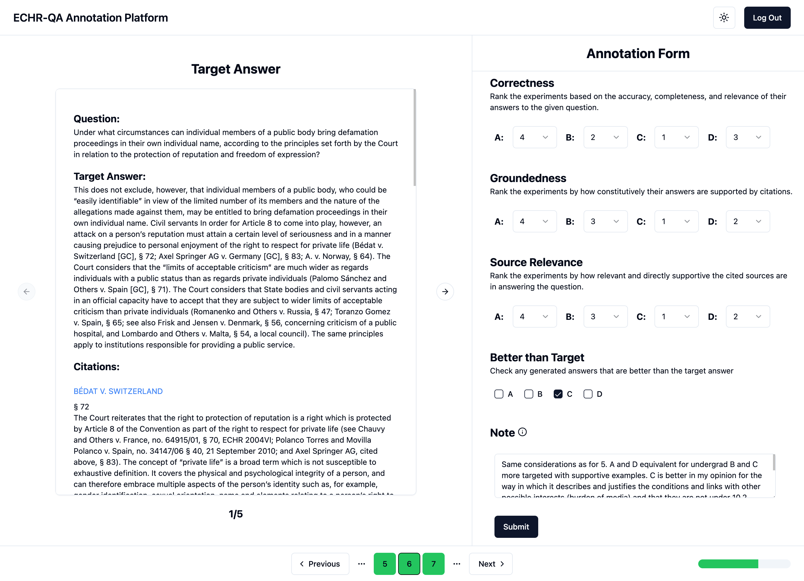

# ECHR-QA Annotation Platform

This project contains all code of our annotation platform designed for ECHR-QA.
The annotation results can be found under `server/data/expert_annotations.json`.



## Development instructions

1. Run the server

```
cd server
fastapi dev src/main.py
```

2. Run the app

```
cd app
npm run dev
```

3. Run nginx

```
brew install nginx
nginx -c /full/path/.../nginx.conf
nginx -s reload
nginx -s stop
```

Note: nginx points to 8001

4. Expose with ngrok

```
ngrok http 8001
```
